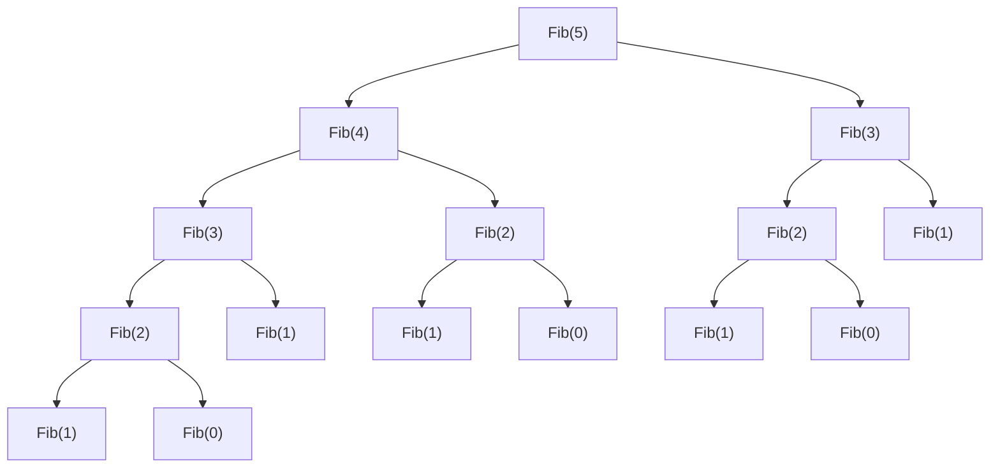

# 알고리즘 패러다임

알고리즘 패러다임(Algorithmic Paradigm) 혹은 알고리즘 디자인 패러다임은 자주 등장하는 알고리즘 접근법을 의미하며, 여러 문제에 통상적으로 사용될 수 있습니다. 이 게시글을 이해하기 위해서는 일반적인 자료구조와 재귀함수를 응용할 수 있어야 함을 알립니다.

## 완전탐색

브루트 포스(Brute Force) 알고리즘이며, 모든 경우의 수를 전부 탐색하는 것을 의미합니다.

## 백트래킹

## 분할 정복

문제를 간단히 풀 수 있을 때까지 계속 분할하고, 분할된 문제의 해답을 찾아 그 해답을 합쳐서 문제를 해결하는 방식입니다. 다음과 같은 세가지 단계로 나뉠 수 있는데,

1. 분할(divide) : 문제를 같은 방식으로 해결할 수 있는 부분 문제로 나눈다
2. 정복(conquer) : 각 부분 문제의 해답을 구한다
3. 결합(combine) : 정복한 결과를 결합하여 전체 문제의 해답을 구한다

이진 검색 또한 분할 정복에 해당되기는 하지만, 이진 검색의 경우 특이한 케이스로 부분 문제의 해답이 그대로 전체 문제의 해답(값을 찾는다)이 되기 때문에 결합 단계가 필요하지 않습니다.

분할 정복의 예시로 "병합 정렬" 을 들 수 있는데, 배열의 크기가 충분히 작아질 때까지 같은 크기인 2개의 부분배열로 **분할** 하고 부분 배열을 정렬하여 **정복** 하고 정렬된 배열들을 하나로 병합함으로써 **결합** 합니다. 병합 정렬에서는 결합과 동시에 정렬하기 때문에 정복과 결합이 동시에 이루어진다고 볼 수 있습니다.

## 그리디 알고리즘

선택의 순간마다 현재로서의 최적인 해답만을 구해나가는 알고리즘 패러다임입니다. 예를 들어 서울에서 인천까지 간다고 할 때, 각 교차로마다 가장 가까운 경로를 선택하는 걸 생각할 수도 있습니다. 이 경우, 완벽한 최단 경로는 아니지만 최단 경로에 근접한 값을 얻을 수 있죠. 알고리즘 풀이에서도 비슷하게 사용되는데, 보통 그리디 기법을 사용한 부분 문제의 최적해가 전체 문제의 최적해와 같은 문제들이 많이 존재하고, 어려운 문제의 경우 우선 그리디로 최적해 후보들을 구한 후에 정확한 답을 구하는 방법을 사용하기도 합니다.

좀 더 구체적인 예를 들자면, 만약 은행이 있고 번호표를 뽑은 사람들과 그 사람마다의 일처리 시간이 존재할 때 대기시간을 최소로 한다면 그냥 일처리 시간이 제일 짧은 사람부터 먼저 처리하는 방법을 생각할 수 있죠.

그리디 알고리즘을 사용하기 위해 필요한 조건으로는 "최적 부분 구조 속성" 과 "그리디 선택 속성" 이 존재합니다. 이 조건을 만족하지 못하면 완전한 최적해는 구할 수 없습니다.

1. 최적 부분 구조(Optimal Substructure): 주어진 문제 P에 대한 최적의 솔루션이 P의 부분 문제들의 최적의 솔루션으로 구성되어야 한다
2. 그리디 선택(Greedy Choice): 주어진 문제 P에 대한 지역적 최적 솔루션을 반복적으로 선택하여 전체 최적 솔루션을 구할 수 있어야 한다

그리디의 예제로는 크루스칼의 최소 신장 트리를 들 수 있습니다.

## 동적계획법

동적 계획법은 주로 재귀적이고, 반복적인 문제를 해결하는 경우에 사용됩니다. 간단하게 요약하면 이미 한번 계산한 문제의 답을 저장(캐시, cache)해 두고, 다음에 같은 문제를 해결해야 할 때 저장해 둔 문제의 답을 사용하는 방식으로 사용됩니다.

가장 간단한 예시로 피보나치 수열이 존재합니다. 피보나치 수열은 `{0, 1, 1, 2, 3, 5, 8, 13, 21, ...}` 과 같은 수열로, 규칙을 찾아보면 i번째 피보나치 수는 i-1번째 피보나치 수 + i-2번째 피보나치 수라는 `F[i] = F[i-1] + F[i-2]` 재귀적인 규칙, 즉 **재귀 관계(Recurrence Relation)** 을 가지고 있는 것을 알 수 있습니다. 여기서 `F[0] = 0`과 `F[1] = 1` 은 **기저 조건(base case)** 으로, 재귀가 존재하지 않아도 해를 구할 수 있는, 재귀가 종료되는 지점입니다.

```cpp
int Fib(int n)
{
  if (n < 2)
    return n;

  return Fib(n - 1) + Fib(n - 2);
}
```

위 코드는 재귀함수로 피보나치를 표현한 것입니다. 재귀 함수를 사용한 경우를 **하향식(Top-down)** 이라고 하는데, 함수 호출을 트리로 표현한 경우 맨 꼭대기부터 기저 조건까지 아래쪽으로 이동하기 때문입니다.



동적 계획법은 위와 같이 문제가 여러개의 부분 문제/중간 문제로 분할되어 풀어져야 하고, 이 부분 문제들이 한 번 이상 반복해 나타난다는 **중복되는 부분 문제(Overlapping Subproblem)** 특성을 가지고 있습니다. 분할 정복과의 차이가 바로 이 점인데, 분할 정복에서는 각 부분문제가 서로 독립적이지만 동적 계획법에서는 같은 부분 문제를 반복해서 풀어야 합니다.

또한 여러 부분 문제가 서로 완전히 동일하다는 것을 알 수 있는데, `F[2]` 를 구해야 할 때 이게 `F[3]` 에서 필요하던 `F[2]` 에서 필요하던 상관없이 같은 연산을 하기 때문입니다. 이를 **최적 부분 구조(Optimal Substructure)** 특성이라고 하며, 전체 문제에 대한 최적해가 부분 문제의 최적해의 조합으로 표현됨을 뜻합니다.

동적 계획법으로 문제를 해결하기 위해선 위 2개의 특성이 만족되어야 하며, 각 부분 문제의 해를 기억해야 하기 때문에 입력의 수에 따라 공간복잡도가 증가하지만, 그만큼 시간복잡도를 낮출 수 있는 기법입니다.

### 메모이제이션, 하향식(Top-down)

메모이제이션(Memoization) 혹은 하향식이라는 기법은 처음에 설명한 것 그대로 "부분 문제의 해답을 찾으면 이를 저장(캐시, cache)해 둔다" 를 구현한 방법입니다. 재귀 함수를 이용한 하향식 풀이일 경우에 사용된 동적 계획법이 이에 해당합니다.

```cpp
int memo[100];

int Fib(int n)
{
  if (n < 2)
    return n;

  if (memo[n] != 0)
    return memo[n];

  // C++에서 대입 연산자(=) 는 대입된 값, 즉 memo[n]을 반환합니다
  return memo[n] = Fib(n - 1) + Fib(n - 2);
}
```

입력값 `n` 이 부분 문제를 결정하기 때문에 만약 입력값 `n` 에 대한 값이 이미 저장되어 있다면 저장된 값을 반환하고, 값이 저장되어 있지 않다면 계산하고, 저장해 줍니다. 메모이제이션으로 문제를 해결하고 싶을 때는 캐시에 인덱싱하는 방법이 유효하고, 유용해야 합니다. 이 문제의 경우는 n만이 현재 문제 단계의 **상태(state)** 를 나타내는데, 문제가 복잡해질 경우 상태를 결정하는 요인이 더 많아질 수 있습니다.

또한, 재귀 호출이 너무 깊어질 경우 스택 오버플로(Stack Overflow) 가 발생할 수 있으며 이 경우는 메모이제이션을 사용할 수 없기 때문에 조심해야 합니다.

### 타뷸레이션, 상향식(Bottom-up)

타뷸레이션(Tabulation) 혹은 상향식이라는 기법은 메모이제이션의 반대 방법입니다. 메모이제이션은 문제를 계산했을 때 그 결과를 저장하지만, 타뷸레이션은 기저 조건부터 시작해 모든 부분 문제의 답을 저장하여 재사용하는 방법입니다. 그러니까, 이전에 구했던 최적해를 이용해서 **다음** 최적해를 구합니다.

```cpp
int Fib(int n) {
  int memo[100];
  memo[0] = 0;
  memo[1] = 1;

  for (int i = 2; i <= n; i++)
    memo[i] = memo[i - 1] + memo[i - 2];
  
  return memo[n];
}
```

타뷸레이션 풀이는 주로 **i번째 해를 구하기 위한 점화식** 을 만들어서 풀이하게 됩니다. 피보나치 수열의 경우 i번째 피보나치 수는 i-1번째 피보나치 수 + i-2번째 피보나치 수라는 `F[i] = F[i-1] + F[i-2]` 규칙을 그대로 사용한 것이 되죠. 하지만 보통 이 점화식을 직접 찾아내야 하며, 상태가 다차원이 되거나 상태 전환에 여러 조건식이 필요해 까다로운 방식입니다. 하지만 타뷸레이션은 메모리를 매우 효율적으로 사용할 수 있는데, 위 문제의 경우 다음 값을 구하기 위해 그 전과 전전번째 값만 필요하기 때문에 3가지 상태만 기억해두면 됩니다.

```cpp
int Fib(int n) {
  int a, b, c;
  a = 0;
  b = 1;
  for (int i = 0; i < n; i++) {
    c = a + b;
    a = b;
    b = c;
  }

  return a;
}
```

보통 메모이제이션으로 풀 수 있는 문제는 타뷸레이션으로도 풀 수 있으며, 타뷸레이션은 한번에 짜내기가 어렵기 때문에 우선 메모이제이션으로 풀이한 뒤 타뷸레이션으로 바꾸는 것도 가능합니다.

### 동적 계획법 역추적

## 스위핑